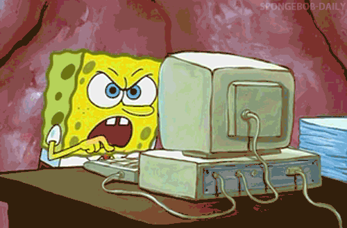

## Vanessa de Araujo


Desenvolvedora FrontEnd
Ex Aluna da Turma SouDevMulheres
LinkeIn: VanessaAraujoV

---

## Maritana Alves


Desenvolvedora FullStack
Monitora na Digital College
Estagiária na Softlog
LinkedIn: MaritanaAlves

---

# Objetivos

- Compreender os conceitos básicos do HTML;
- Familiarizar-se com as tags e sua estrutura básica;
- Criar uma página web simples usando o HTML.

---

# Recursos necessários:

- Computador com acesso à internet e um navegador;
- Editor de Texto (VSCode).

---

# Introdução ao HTML

### HTML (hypertext Markup Language)

<div align="center">


</div>

É a linguagem de marcação padrão para criação de páginas web. Ele é essencial para estruturar e organizar o conteúdo das páginas que visitamos diariamente na internet.

<!--O HTML desempenha um papel fundamental no desenvolvimento web, permitindo que criemos, links, títulos, parágrafos, imagens e vários outros elementos que compõem as páginas web. Ele trabalha em conjunto com o CSS para definir a aparência desses elementos e com o JavaScript para adicionar interatividade e funcionalidades às páginas. -->

<!--Mostrar um site funcionando, acessar: https://digitalcollege.com.br/-->

---

# Estrutura básica do HTML

```C
<!DOCTYPE html>
<html lang="pt-br">
  <head>
    <meta charset="utf-8">
    <title>Primeiro Projeto</title>
  </head>
  <body>
    <p>Olá Mundo!</p>
  </body>
</html>
```

<!--
- <!DOCTYPE HTML> Essa declaração informa ao navegador que o documento está escrito em HTM5, a versão mais recente e amplamente usada do HTML.
É a definição do documento. Serve para informar ao navegador que tipo de documento ele está lidando. ela é obrigatória em um documento HTML.
- <html lang="pt=br"> É a tag principal, que comporta todos os outros elementos filhos, é nessa tag que declaramos o idioma principal do documento, através do atributo lang
- <head> providencia informações gerais (metadados) sobre o documento, incluindo seu título e links para scripts e folhas de estilos. UTF-8, o padrão de codificação mais utilizado. <title> Título mostrado na aba da página.
- <body> É onde fica todo o conteúdo visível da página . Aqui é onde incluímos cabeçalhos, parágrafos, imagens, links e todos os outros elementos que queremos que os visitantes vejam na página.
-->

---

# Tags HTML


<!--
A anatomia de um elemento HTML é formada pela tag de abertura, tag de fechamento, o atributo e valor do atributo, e o conteúdo que será exibido.
-->

---

# Tags HTML

## Títulos

```C
<h1>Título 01</h1>

<h2>Título 02</h2>

<h3>Título 03</h3>

<h4>Título 04</h4>

<h5>Título 05</h5>

<h6>Título 06</h6>
```

 <!-- esses são os níveis de títulos html, sendo o h1 de maior importância e o h6 de menor. ajudam na semântica do código -->

---

# Tags HTML

```C
<p>Este é um paragráfo!</p>

<a href="https://digitalcollege.com.br/"
target="_blank">site da digital college</a>

<strong>Texto negrito</strong>
<em>texto itálico</em>
<u>Texto Sublinhado</u>


<br>quebras de linhas
```

<!-- tag a é um elemento âncora, ela junto com o href nos ajuda a marcar os links para qualquer coisa. como imagem, algum site como esse exemplo da digital college -->
<!-- tags <strong>, <em> e <u> servem para dar importância ao texto. a tag <strong> deixa o texto em negrito, o <em> deixa itálico e o <u> deixa sublinhado -->

<!-- o  nos possibilita inserir imagens ao nosso documento HTML junto com essa tag vem o src(resource), que é o recurso onde apontamos a localização dessa imagem -->

<!-- o <br> faz uma quebra de linha  -->

---

# Tags HTML

Listas não ordenadas

```C
<ul>
  <li>Maçã</li>
  <li>Pera</li>
</ul>
```

Listas ordenadas

```C
<ol>
  <li>primeiro</li>
  <li>segundo</li>
</ol>
```

<!-- listas não ordenadas são listas que não numeradas. listas ordenadas são listas numeradas. nos ajudam a deixar o texto mais organizado e bonito -->

---

# Vamos praticar?

<div align="center">



</div>

---
